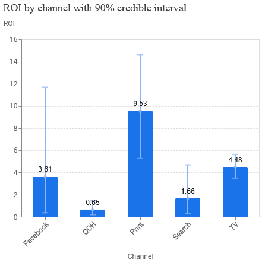
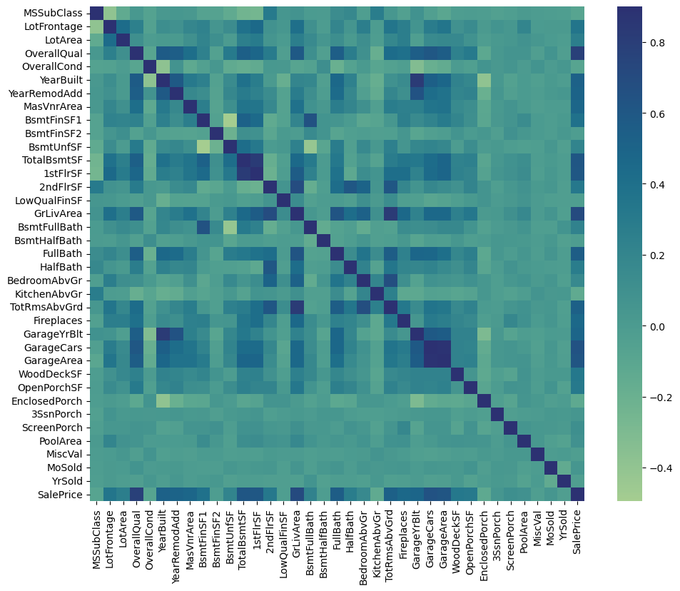
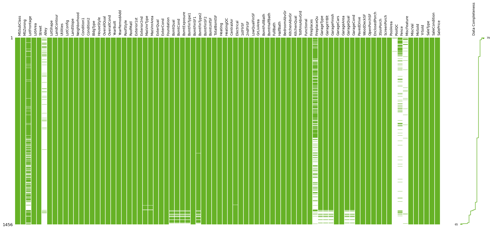
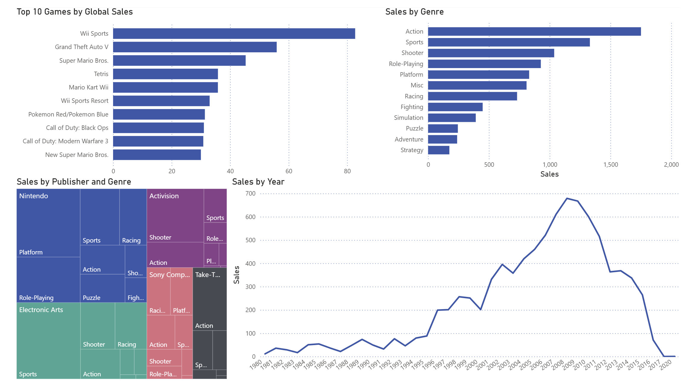
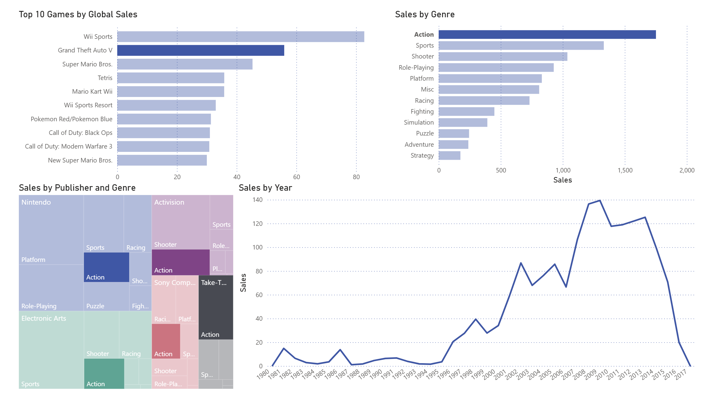

# My Portfolio
Data science &amp; analytics projects.

## Projects

### [Marketing Mix Modeling →](https://github.com/Holden141/marketing-mix-modeling)
Bayesian MMM with Google Meridian. 4 years of weekly data, 5 channels. Identified 61.9% budget misallocation, recommended reallocation for +2.1% revenue lift.

*Key skills: Python, Bayesian stats, MCMC, ROI analysis*

---

### [House Price Prediction →](https://github.com/Holden141/house-price-prediction)
Stacked ensemble (Ridge, Lasso, XGBoost) on Kaggle housing data. Feature engineering on 81 variables. Top 5% finish (0.0475 RMSLE).

*Key skills: Python, scikit-learn, feature engineering, cross-validation*

---

### Gaming Sales Dashboard
Interactive Power BI dashboard analyzing 16,500+ games. 

*Key skills: Power BI, data visualization, DAX*

---

*Python projects contains its own README with full details, code, and screenshots.*