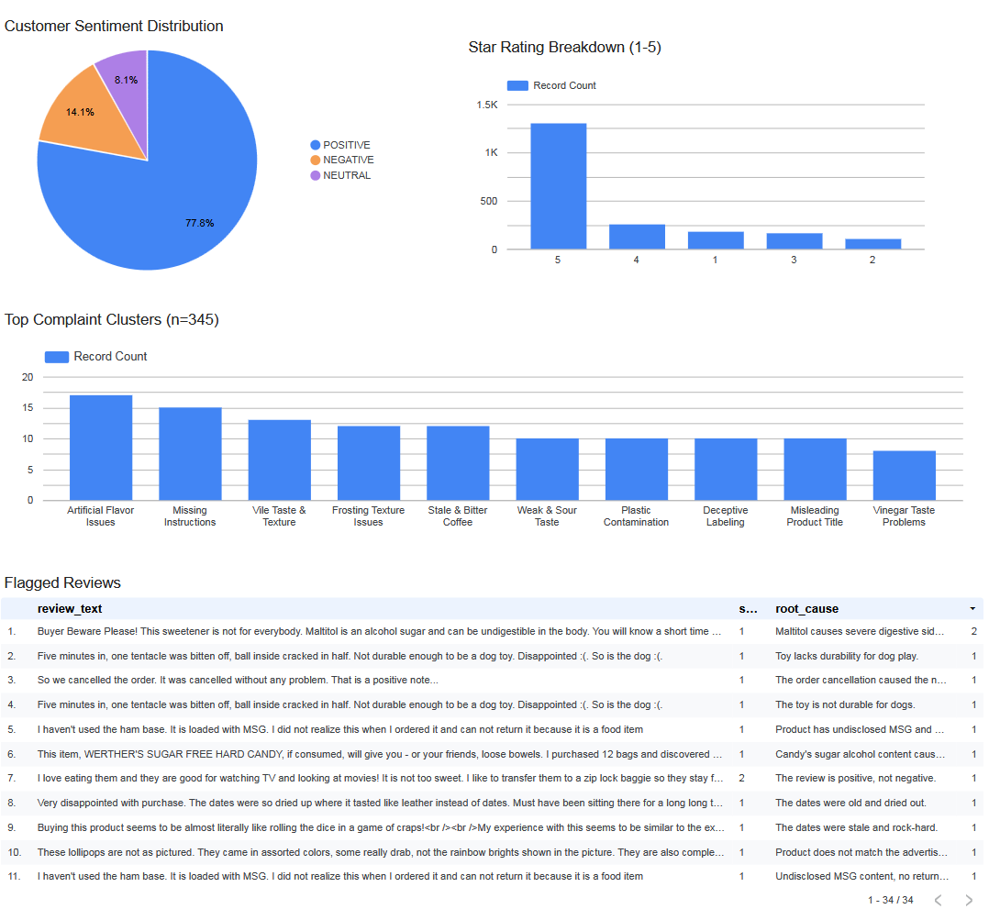

# My Portfolio
Data science &amp; analytics projects.

## Projects

### [Amazon Reviews Pipeline](./projects/amazon-reviews-pipeline/)
End-to-end data pipeline: daily ingestion → dbt transformation → LLM root cause analysis → clustering → anomaly detection. Processes Amazon product reviews across multiple categories (food, electronics, pet supplies).

*Key skills: BigQuery, dbt, Python, LLM (DeepSeek), clustering (HDBSCAN), anomaly detection (Isolation Forest), GitHub Actions, Looker Studio*

---

### [Marketing Mix Modeling →](./projects/mmm-marketing/)
Bayesian MMM with Google Meridian. 4 years of weekly data, 5 channels. Identified 61.9% budget misallocation, recommended reallocation for +2.1% revenue lift.

*Key skills: Python, Bayesian stats, MCMC, ROI analysis*

---

### [House Price Prediction →](./projects/kaggle-housing/)
Stacked ensemble (Ridge, Lasso, XGBoost) on Kaggle housing data. Feature engineering on 81 variables. Top 5% finish (0.0475 RMSLE).

*Key skills: Python, scikit-learn, feature engineering, cross-validation*

---

### [Cookie Cats A/B Test](./projects/cookie_cats-ab-testing/)
Mobile game A/B test analysis. Moving the first gate to level 40 significantly improved 7-day retention (p = 0.0016).

*Key skills: Python, A/B testing, statistical analysis (Mann-Whitney, chi-square)*
---

### [Gaming Sales Dashboard](./projects/powerbi-gaming/)
Interactive Power BI dashboard analyzing 16,500+ games. 

*Key skills: Power BI, data visualization, DAX*

---
*Python projects contains its own README with full details, code, and screenshots.*