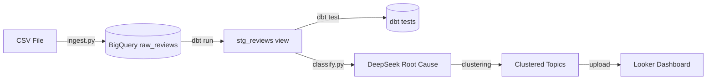

# ✅ Core pipeline complete — ingestion, transformation, testing are fully implemented.

> Work in progress — core pipeline complete, visualization and automation coming soon.

Automated data pipeline that ingests Amazon product reviews, transforms them with dbt, and prepares them for analysis. Built as a portfolio project to demonstrate data engineering and analytics skills.
Original Dataset: https://www.kaggle.com/datasets/arhamrumi/amazon-product-reviews .

## 🎯 What It Does

- **Ingestion**: Loads a sample of Amazon reviews from CSV to BigQuery
- **Transformation**: dbt models of clean data and add sentiment classification (`POSITIVE`/`NEUTRAL`/`NEGATIVE`)
- **Testing**: Automated data quality tests (unique keys, not nulls, valid value ranges)
- **Orchestration**: Scheduled daily runs via GitHub Actions
- **LLM Classification**: Identifies root causes of negative reviews
- **Clustering**: Groups Negative reviews in clusters.
## 🛠️ Tech Stack

| Layer | Tools |
| :--- | :--- |
| Data Warehouse | Google BigQuery |
| Transformation | dbt (SQL models) |
| Orchestration | GitHub Actions |
| Language | Python |
| Visualization | Looker   |
| LLM Integration | Deepseek-v4-flash |

## 📊 Pipeline Architecture
CSV → Python (ingest) → BigQuery (raw_reviews) → dbt → BigQuery (stg_reviews) → Tests → Looker Dashboard
                                                                                   ↓                                                                        
LLM Root Cause Analysis
## 🔬 LLM Root Cause Analysis

- **Classification**: Deepseek-v4-flash identifies root causes from negative review text
- **Clustering**: Sentence embeddings + HDBSCAN group similar complaints
- **Automated Categorization**: LLM names each cluster (e.g., "Misleading Label", "Texture Issues")
- **Dashboard**: Looker bar chart shows top complaints

### Resources:
- dbt [docs](https://docs.getdbt.com/docs/introduction)

