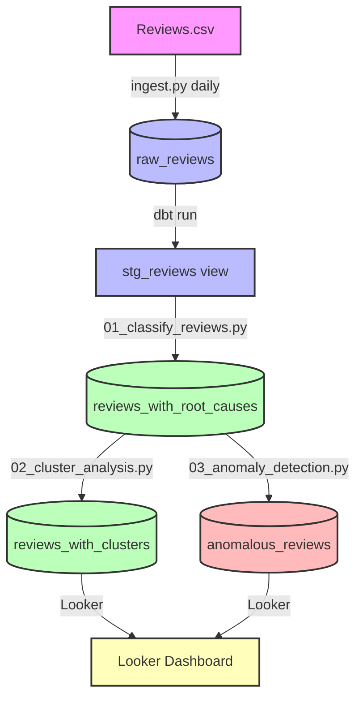

# Amazon Reviews Pipeline

> ✅ Core pipeline complete — daily incremental ingestion, transformation, testing, LLM classification, clustering, and anomaly detection.

Automated data pipeline that ingests Amazon product reviews, transforms them with dbt, and prepares them for analysis. Built as a portfolio project to demonstrate data engineering and analytics skills.
**Original Dataset**: https://www.kaggle.com/datasets/arhamrumi/amazon-product-reviews .

## 🎯 What It Does

| Stage | Description | Output |
| :--- | :--- | :--- |
| **Ingestion** | Incrementally loads 100 rows/day from CSV to BigQuery | `raw_reviews` |
| **Transformation** | dbt models with sentiment classification (POSITIVE/NEUTRAL/NEGATIVE) | `stg_reviews` |
| **LLM Root Cause** | DeepSeek extracts root cause from each negative review | `reviews_with_root_causes` |
| **Clustering** | Sentence embeddings + HDBSCAN groups similar complaints | `reviews_with_clusters` |
| **Anomaly Detection** | Isolation Forest flags suspicious reviews | `anomalous_reviews` |

## 🛠️ Tech Stack

| Layer | Tools |
| :--- | :--- |
| Data Warehouse | Google BigQuery |
| Transformation | dbt (SQL models) |
| LLM | DeepSeek API |
| Embeddings | sentence-transformers (all-MiniLM-L6-v2) |
| Clustering | UMAP + HDBSCAN |
| Anomaly Detection | Isolation Forest (scikit-learn) |
| Orchestration | GitHub Actions (daily schedule) |
| Visualization | Looker Studio |

## 📊 Pipeline Architecture

## 🔬 Looker Dashboard

> *Dashboard shows: customer sentiment (76% positive), star rating distribution, top complaint clusters from 345 negative reviews, and 15 flagged anomalies.*