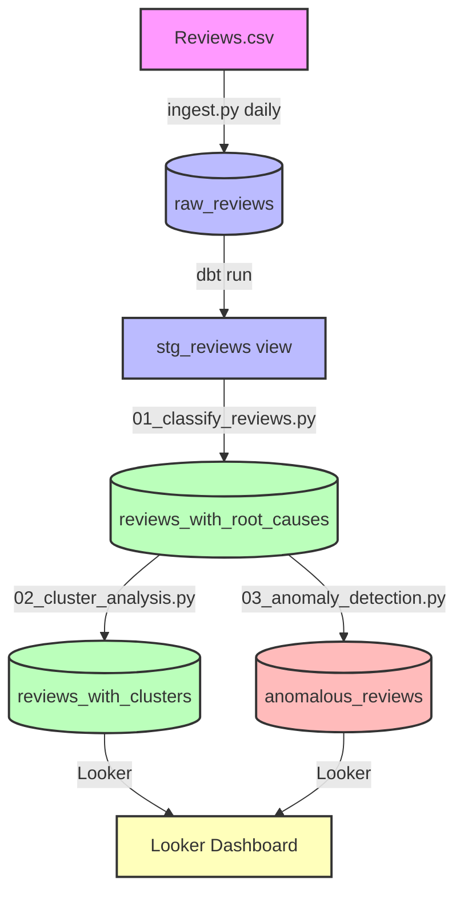
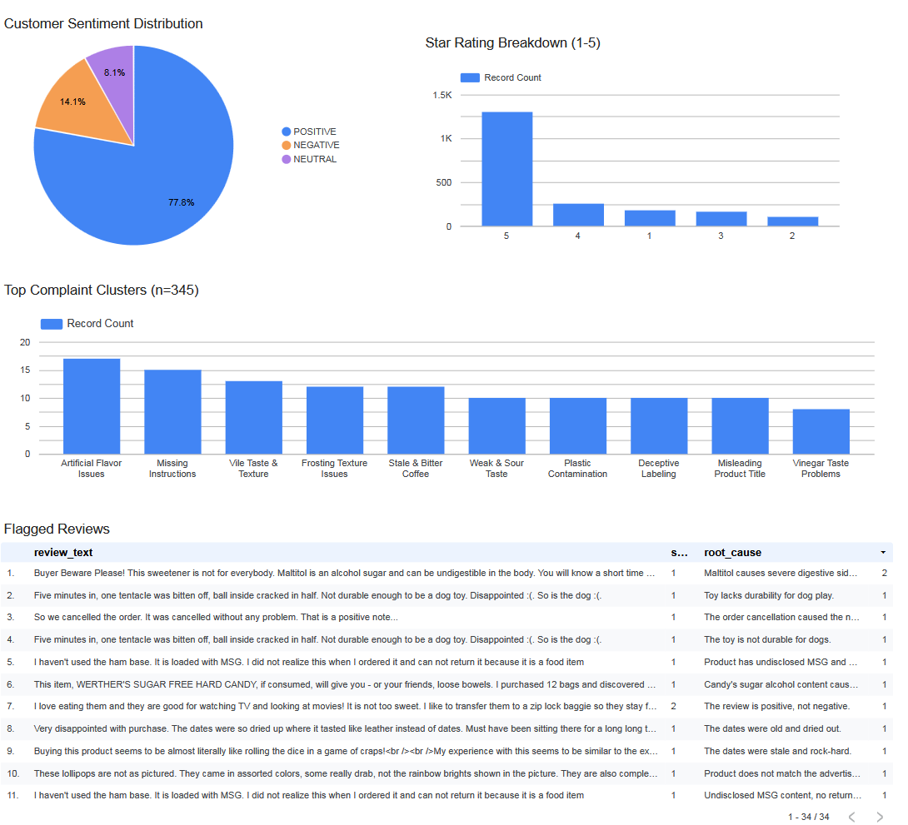

# Amazon Reviews Pipeline

> ✅ Core pipeline complete — daily incremental ingestion, transformation, testing, LLM classification, clustering, and anomaly detection.
> ✅ Deployed Chatbot 
> ✅ Airflow migration
> 🔨 WIP: Database Normalisation

Automated data pipeline that ingests Amazon product reviews, transforms them with dbt, and prepares them for analysis. Built as a portfolio project to demonstrate data engineering and analytics skills.
## 💬 Live Demo

**Try the chatbot here:** [https://amazon-complaints-assistant.streamlit.app/](https://amazon-complaints-assistant.streamlit.app/)

Ask questions about 1,545 negative Amazon reviews. The app uses Pinecone for vector search and DeepSeek to generate answers.
## 🎯 What It Does

| Stage | Description | Output |
| :--- | :--- | :--- |
| **Ingestion** | Incrementally loads 100 rows/day from CSV to BigQuery | `raw_reviews` |
| **Transformation** | dbt models with sentiment classification (POSITIVE/NEUTRAL/NEGATIVE) | `stg_reviews` |
| **LLM Root Cause** | DeepSeek extracts root cause from each negative review | `reviews_with_root_causes` |
| **Clustering** | Sentence embeddings + HDBSCAN groups similar complaints | `reviews_with_clusters` |
| **Anomaly Detection** | Isolation Forest flags suspicious reviews | `anomalous_reviews` |
| **Chatbot** | Convert csv to RAG. Query over Deepseek. Deployed on Streamlit. | https://amazon-complaints-assistant.streamlit.app/|
| **Airflow**  | Pipeline now managed by Airflow | Runs in Docker|

## 🛠️ Tech Stack

| Layer | Tools |
| :--- | :--- |
| Data Warehouse | Google BigQuery |
| Transformation | dbt (SQL models) |
| LLM | DeepSeek API |
| Embeddings | sentence-transformers all-MiniLM-L6-v2 (local)/llama-text-embed-v2 (pinecone)|
| Clustering | UMAP + HDBSCAN |
| Anomaly Detection | Isolation Forest (scikit-learn) |
| Orchestration | ~~GitHub Actions (daily schedule)~~ Now Airflow |
| Visualization | Looker Studio |
| RAG Chatbot | Streamlit, Pinecone, Deepseek |
| 

## 📊 Pipeline Architecture

```mermaid
graph TD 
    CSV[Reviews.csv] -->|ingest.py daily| RAW[(raw_reviews)]
    RAW -->|dbt run| STG[stg_reviews view]
    STG -->|01_classify_reviews.py| ROOT[(reviews_with_root_causes)]
    ROOT -->|02_cluster_analysis.py| CLUSTER[(reviews_with_clusters)]
    ROOT -->|03_anomaly_detection.py| ANOM[(anomalous_reviews)]
    CLUSTER -->|Looker| DASH[Looker Dashboard]
    ANOM -->|Looker| DASH

    style CSV fill:#f9f,stroke:#333,stroke-width:2px
    style RAW fill:#bbf,stroke:#333,stroke-width:2px
    style STG fill:#bbf,stroke:#333,stroke-width:2px
    style ROOT fill:#bfb,stroke:#333,stroke-width:2px
    style CLUSTER fill:#bfb,stroke:#333,stroke-width:2px
    style ANOM fill:#fbb,stroke:#333,stroke-width:2px
    style DASH fill:#ffb,stroke:#333,stroke-width:2px
```

## 🔬 Looker Dashboard

> *Dashboard shows: customer sentiment (76% positive), star rating distribution, top complaint clusters from 345 negative reviews, and 15 flagged anomalies.*

Original Dataset: https://www.kaggle.com/datasets/arhamrumi/amazon-product-reviews 